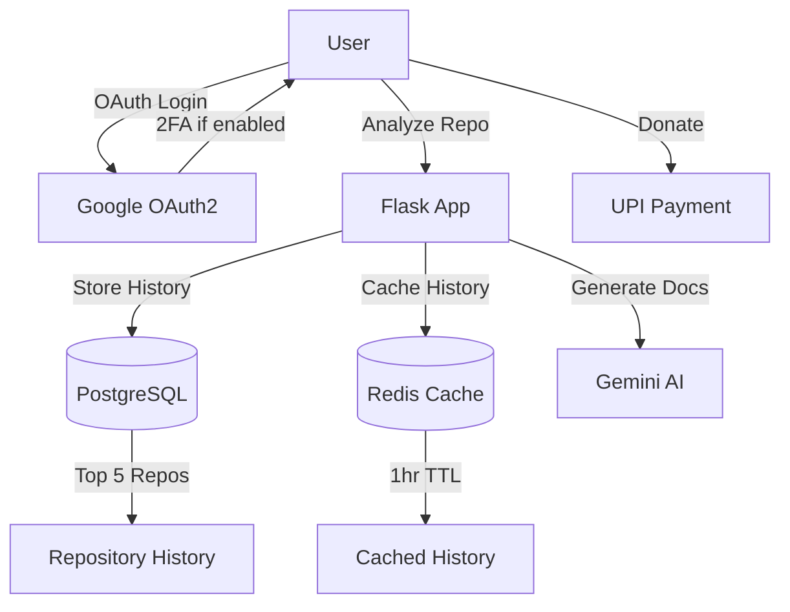

# Google OAuth2 & Feature Integration Setup Guide

## Overview
This guide will help you set up all the new features implemented in ArchiMind:
- **Google OAuth2 Login** with 2FA support
- **Repository History** with top 5 caching (Redis)
- **Donation Integration** with UPI payment
- **Enhanced UI** with history display for logged-in users

## Prerequisites
- Python 3.11+
- PostgreSQL 15+
- Redis 6.0+
- Google Cloud Platform account

---

## 1. Install Dependencies

```bash
pip install -r requirements.txt
```

New dependencies added:
- `Flask-Dance==7.0.0` - OAuth integration
- `Authlib==1.3.0` - OAuth client library
- `redis==5.0.1` - Redis caching

---

## 2. Google OAuth2 Setup

### Step 1: Create Google Cloud Project

1. Go to [Google Cloud Console](https://console.cloud.google.com/)
2. Create a new project or select an existing one
3. Enable the **Google+ API** for your project

### Step 2: Create OAuth2 Credentials

1. Navigate to **APIs & Services** > **Credentials**
2. Click **Create Credentials** > **OAuth 2.0 Client ID**
3. Configure the consent screen:
   - Application name: `ArchiMind`
   - User support email: Your email
   - Developer contact: Your email
4. Application type: **Web application**
5. Add Authorized redirect URIs:
   ```
   http://localhost:5000/login/google/callback
   https://yourdomain.com/login/google/callback  (for production)
   ```
6. Click **Create** and download the credentials

### Step 3: Update Environment Variables

Add to your `.env` file:

```env
# Google OAuth2 Configuration
GOOGLE_CLIENT_ID=your_google_client_id_here
GOOGLE_CLIENT_SECRET=your_google_client_secret_here
OAUTHLIB_INSECURE_TRANSPORT=1  # Set to 0 in production with HTTPS

# Redis Configuration
REDIS_URL=redis://localhost:6379/0
```

### Note on 2FA Support
Google OAuth automatically handles 2FA if it's enabled on the user's Google account. No additional configuration is needed. When a user with 2FA enabled logs in via Google OAuth, they will be prompted to complete their 2FA verification on Google's side before being redirected back to your application.

---

## 3. Redis Setup

### Install Redis (Ubuntu/Debian)

```bash
sudo apt update
sudo apt install redis-server
sudo systemctl start redis-server
sudo systemctl enable redis-server
```

### Install Redis (macOS)

```bash
brew install redis
brew services start redis
```

### Verify Redis is Running

```bash
redis-cli ping
# Should return: PONG
```

---

## 4. Database Migrations

Run the application once to create new database tables:

```bash
python app.py
```

This will create:
- `repository_history` table - Stores top 5 repositories per user
- Updated `users` table with OAuth fields (`oauth_provider`, `oauth_id`)

Or manually run migrations if you use Alembic:

```bash
flask db migrate -m "Add OAuth and repository history"
flask db upgrade
```

---

## 5. UPI Donation Configuration

The donation buttons are already configured with your UPI ID: `7524897234@paytm`

**Locations where donation buttons appear:**
1. Main page header (next to GitHub button)
2. Login page footer
3. Sign-up page footer
4. Rate limit modal (for anonymous users)

**UPI Payment Flow:**
- Uses standard UPI deep linking
- Works on mobile devices with UPI apps installed
- Desktop users will see a payment option if they have a UPI bridge extension

---

## 6. Features Overview

### 6.1 Google OAuth2 Login

**Benefits:**
- One-click login with Google account
- Automatic 2FA support (if enabled on user's Google account)
- No password management required
- Secure authentication flow

**User Flow:**
1. User clicks "Continue with Google"
2. Redirected to Google authentication
3. If 2FA enabled, Google prompts for verification
4. User grants permissions
5. Redirected back to ArchiMind, logged in

### 6.2 Repository History (Top 5 with Redis Caching)

**How it works:**
- Stores only the **top 5 most recent** repositories per user
- Automatically purges oldest entry when adding a 6th repository
- **Saved data:**
  - Repository URL and name
  - Full Gemini-generated documentation
  - HLD and LLD graph JSON
  - Last accessed timestamp

**Redis Caching:**
- First access: Fetches from PostgreSQL, caches in Redis (1 hour TTL)
- Subsequent access: Retrieves from Redis (instant)
- Cache invalidation: Automatic when new repository is added
- Fallback: If Redis fails, fetches from PostgreSQL

**API Endpoints:**
- `GET /api/history` - Get user's repository history (requires auth)
- `GET /api/history/<id>` - Get specific repository details (requires auth)

### 6.3 Enhanced UI

**For Authenticated Users:**
- Repository history section below the input field
- Click on any history item to auto-fill the URL
- No rate limit modal
- Welcome message in header

**For Anonymous Users:**
- 5 free generations limit
- Rate limit modal with donation option
- Google OAuth login in modal
- No history section

---

## 7. Testing OAuth Flow

### Local Testing

1. Start the application:
   ```bash
   python app.py
   ```

2. Access `http://localhost:5000`

3. Click "Continue with Google" on:
   - Login page: `/login`
   - Sign-up page: `/sign-up`
   - Rate limit modal (after 5 free generations)

4. You should be redirected to Google's consent screen

5. After authentication, you'll be redirected back and logged in

### Test 2FA

1. Enable 2-Step Verification on your Google account
2. Try logging in via OAuth
3. Google will prompt for your 2FA code
4. Complete verification
5. Successfully logged into ArchiMind

---

## 8. Production Deployment Checklist

- [ ] Set `OAUTHLIB_INSECURE_TRANSPORT=0` in `.env`
- [ ] Use HTTPS for your production domain
- [ ] Update Google OAuth redirect URIs to use `https://`
- [ ] Configure Redis with authentication:
  ```env
  REDIS_URL=redis://:password@localhost:6379/0
  ```
- [ ] Set up Redis persistence (AOF or RDB)
- [ ] Configure firewall rules for Redis (port 6379)
- [ ] Use environment-specific OAuth credentials (dev vs prod)
- [ ] Test UPI payments on mobile devices
- [ ] Monitor Redis memory usage
- [ ] Set up Redis backup strategy

---

## 9. Troubleshooting

### OAuth Errors

**Error: `redirect_uri_mismatch`**
- Check that your redirect URI in Google Cloud Console matches exactly
- Include `http://` or `https://` protocol
- Don't forget the `/login/google/callback` path

**Error: `invalid_client`**
- Verify `GOOGLE_CLIENT_ID` and `GOOGLE_CLIENT_SECRET` in `.env`
- Ensure no extra whitespace in credentials

### Redis Connection Issues

**Error: `Connection refused`**
```bash
# Check if Redis is running
sudo systemctl status redis-server

# Start Redis if stopped
sudo systemctl start redis-server
```

**Error: `Authentication required`**
- Update `REDIS_URL` with password if Redis requires auth

### Repository History Not Showing

1. Check if user is authenticated: `{{ user.is_authenticated }}`
2. Verify API endpoint: `curl http://localhost:5000/api/history` (with session cookie)
3. Check browser console for JavaScript errors
4. Ensure PostgreSQL `repository_history` table exists

---

## 10. Architecture Diagram



---

## 11. Security Considerations

1. **OAuth Tokens:** Stored securely in Flask sessions
2. **Password Hashing:** PBKDF2-SHA256 for regular accounts
3. **Session Management:** Server-side sessions with Flask-Login
4. **Redis Security:** 
   - Use password authentication in production
   - Bind to localhost or private network
   - Enable SSL/TLS if over network
5. **Environment Variables:** Never commit `.env` to version control
6. **HTTPS:** Required for production OAuth
7. **CSRF Protection:** Built into Flask with secret key

---

## 12. Monitoring & Maintenance

### Redis Monitoring

```bash
# Check Redis info
redis-cli info

# Monitor commands in real-time
redis-cli monitor

# Check memory usage
redis-cli INFO memory
```

### Clear Redis Cache

```bash
# Clear all cached history
redis-cli FLUSHDB

# Clear specific user's cache
redis-cli DEL "user:1:history"
```

### Database Maintenance

```sql
-- Check repository history count per user
SELECT user_id, COUNT(*) FROM repository_history GROUP BY user_id;

-- Find users with OAuth accounts
SELECT email, oauth_provider FROM users WHERE oauth_provider IS NOT NULL;
```

---

## Support

For issues or questions:
- GitHub Issues: https://github.com/krishnakumarbhat/ArchiMind/issues
- Email: Your support email
- Donations: UPI `7524897234@paytm`

---

## License

MIT License - See LICENSE file for details
