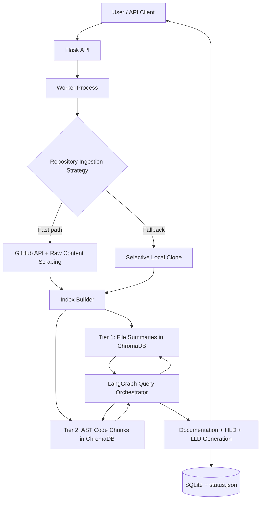

# ArchiMind 🏗️🧠

ArchiMind analyzes a GitHub repository and produces:

- chapter-wise architecture documentation,
- high-level and low-level Mermaid diagrams,
- conversational project summary,
- persistent history for authenticated users.

It uses a RAG-style flow with LangGraph orchestration, LlamaIndex AST `CodeSplitter`, ChromaDB vector search, and SQLite-backed app storage.

## Table of Contents

1. [What You Can Do](#what-you-can-do)
2. [Architecture at a Glance](#architecture-at-a-glance)
3. [Block Diagram](#block-diagram)
4. [How It Works](#how-it-works)
5. [Quick Start (No venv)](#quick-start-no-venv)
6. [Configuration](#configuration)
7. [Run Modes](#run-modes)
8. [API Reference](#api-reference)
9. [Use Cases & Capabilities](#use-cases--capabilities)
10. [Project Structure](#project-structure)
11. [Quality, Testing & Security](#quality-testing--security)
12. [Troubleshooting](#troubleshooting)
13. [Diagrams (DOT files)](#diagrams-dot-files)
14. [Raspberry Pi Deployment](#raspberry-pi-deployment)

## What You Can Do

### Core Capabilities

- Analyze a public GitHub repository from URL.
- Build hierarchical retrieval index (file summaries + AST code chunks).
- Generate a multi-chapter architecture handbook.
- Generate HLD and LLD Mermaid graph payloads.
- View output in a tabbed documentation + graph viewer.

### User Experience Features

- Anonymous mode with per-session limit (default 5 analyses).
- Authenticated mode with unlimited usage and saved history.
- OAuth (Google) optional; classic email/password supported.
- Repository history API stored in SQLite.

## Architecture at a Glance

### Main Runtime Components

- `app.py`: Flask web app, routes, auth, SQLAlchemy models, analysis dispatch.
- `worker.py`: Background execution pipeline that performs repository analysis.
- `services.py`:
    - `RepositoryService` (clone + file extraction)
    - `VectorStoreService` (LlamaIndex AST chunking + ChromaDB + metadata-rich indexing)
    - `DocumentationService` (local context-driven docs/HLD/LLD/summary/chat)
- `oauth_utils.py`: OAuth + lightweight in-process cache helpers.

### End-to-End Flow

1. User submits repository URL (`POST /api/analyze`).
2. App validates request and rate limits.
3. App records `AnalysisLog` entry and spawns `worker.py` subprocess.
4. Worker clones repo (or reuses local clone), reads selected files.
5. Worker builds tier-1 file summaries and tier-2 AST chunks in ChromaDB.
6. LangGraph retrieves relevant files first, then precise code chunks with metadata.
7. Worker writes status/result to `data/status.json` and updates DB log.

## Block Diagram



## How It Works

### 1) Ingestion strategy (speed first)

- For GitHub URLs, the worker first uses GitHub API + raw file endpoints to **scrape important repository files**.
- It prioritizes files such as `README*`, `docs/*`, architecture/design files, and core source entry points (`app`, `api`, `service`, `worker`, etc.).
- For very large repositories, it fetches a scored subset instead of cloning everything.
- If remote scraping is unavailable or insufficient, it falls back to local clone + filesystem scan.

### 2) Hierarchical index

- **Tier 1 (File summaries):** each file gets a compact summary for coarse retrieval.
- **Tier 2 (Code chunks):** source is chunked by AST blocks (functions/classes/methods) where possible using LlamaIndex `CodeSplitter`.
- Every chunk stores metadata: `file_path`, `language`, `function_name`, `github_url`, line range.

### 3) Query pipeline

- LangGraph runs a 2-step retrieval graph:
    1. query summary collection to find relevant files,
    2. query chunk collection scoped to those files.
- Returned context is assembled with metadata-rich headers so downstream HLD/LLD generation stays grounded.

## Quick Start (No venv)

### Prerequisites

- Python 3.10+ (3.11 recommended)
- Git
- No external LLM key required for local mode

### 1) Install dependencies

```bash
pip install -r requirements.txt
```

### 2) Create environment file

```bash
cp .env.example .env
```

Set at least:

- `SECRET_KEY=...`
- `DATABASE_URL=sqlite:///data/archimind_dev.db`

### 3) One-command setup + run

```bash
bash scripts/setup_local.sh
bash scripts/run_local.sh
```

Open `http://127.0.0.1:5000`.

### 4) Run a sample analysis

Use this sample repository URL in the UI:

`https://github.com/LearningCircuit/local-deep-research`

Or via API:

```bash
curl -X POST http://127.0.0.1:5000/api/analyze \
    -H "Content-Type: application/json" \
    -d '{"repo_url":"https://github.com/LearningCircuit/local-deep-research"}'

curl http://127.0.0.1:5000/api/status
```

## Configuration

Primary configuration lives in `.env` and `config.py`.

### Required Environment Variables

| Variable | Required | Description |
|---|---|---|
| `SECRET_KEY` | Yes | Flask session/signing key |
| `DATABASE_URL` | No | Defaults to local SQLite path if omitted |

### Optional Environment Variables

| Variable | Description |
|---|---|
| `FLASK_DEBUG` | `True/False` for local debugging |
| `FLASK_HOST` | Bind host (default `127.0.0.1`) |
| `FLASK_PORT` | Bind port (default `5000`) |
| `ANONYMOUS_GENERATION_LIMIT` | Free analyses per anonymous session |
| `GOOGLE_CLIENT_ID` / `GOOGLE_CLIENT_SECRET` | Optional Google OAuth login |
| `OAUTHLIB_INSECURE_TRANSPORT` | Local HTTP OAuth testing toggle |

### Retrieval Configuration (`config.py`)

- Tier 1: file-level summaries stored in ChromaDB
- Tier 2: AST-based code chunks stored in ChromaDB
- Query orchestration: LangGraph summary-first retrieval pipeline

## Run Modes

### Web App

```bash
bash scripts/run_local.sh
```

### Worker only (manual)

```bash
bash scripts/run_worker.sh https://github.com/owner/repo
```

### Tests

```bash
bash scripts/test_local.sh
```

### Docker

```bash
docker compose up --build
```

## API Reference

### `POST /api/analyze`

Starts asynchronous analysis.

Request:

```json
{
    "repo_url": "https://github.com/owner/repo"
}
```

Responses:

- `202`: started
- `400`: missing/invalid input
- `403`: anonymous limit reached
- `409`: existing analysis still processing

### `GET /api/status`

Returns analysis status and result payload.

Common statuses:

- `idle`
- `processing`
- `completed`
- `error`

### `GET /api/check-limit`

Returns whether current actor can submit analysis.

### `GET /api/history` (authenticated)

Returns cached/history list for logged-in user.

### `GET /api/history/<repo_id>` (authenticated)

Returns full stored artifacts (docs/HLD/LLD) for one repository.

## Use Cases & Capabilities

### 1) Architecture Discovery

- Input: unfamiliar repository URL
- Output: chapter-wise architecture handbook
- Benefit: fast onboarding for new developers

### 2) Design Review Preparation

- Input: actively developed service repo
- Output: HLD + LLD diagrams and narrative summary
- Benefit: reusable artifact for review/ADR conversations

### 3) Team Knowledge Retention

- Input: recurring analyses for authenticated users
- Output: repository history with latest generated artifacts
- Benefit: centralized memory of architecture snapshots

### 4) Portfolio / Due Diligence Analysis

- Input: external OSS repos
- Output: standardized architecture summaries across projects
- Benefit: compare technical shape quickly

## Project Structure

```text
ArchiMind/
├── app.py
├── worker.py
├── services.py
├── oauth_utils.py
├── config.py
├── requirements.txt
├── .env.example
├── scripts/
│   ├── setup_local.sh
│   ├── run_local.sh
│   ├── run_worker.sh
│   └── test_local.sh
├── docs/
│   └── diagrams/
│       ├── hld.dot
│       ├── lld.dot
│       ├── flow.dot
│       └── use_cases.dot
├── static/
├── templates/
└── tests/
```

## Quality, Testing & Security

### Testing

```bash
pytest tests/ -v --cov=.
```

### Linting / Formatting

```bash
black .
isort .
flake8 .
bandit -r .
```

### Security Notes

- Passwords use `pbkdf2:sha256` hashing.
- Avoid committing `.env` and generated data.
- Rotate exposed API keys immediately.

## Troubleshooting

### SQLite `unable to open database file`

- Ensure `data/` exists and is writable.
- Use absolute or normalized SQLite path in `DATABASE_URL`.
- Run `bash scripts/setup_local.sh` to bootstrap required folders.

### `403` limit reached

- Anonymous session hit configured cap.
- Sign in or clear browser session data.

### Empty or weak retrieval context

- Re-run analysis to rebuild summary + chunk collections.
- Verify target repository has supported text/code files.

### OAuth issues in local dev

- Set callback URLs correctly in Google Console.
- Keep `OAUTHLIB_INSECURE_TRANSPORT=1` only for local HTTP.

## Diagrams (DOT files)

Generated architecture/use-case Graphviz files are included:

- `docs/diagrams/hld.dot`
- `docs/diagrams/lld.dot`
- `docs/diagrams/flow.dot`
- `docs/diagrams/use_cases.dot`

Render any DOT file:

```bash
dot -Tpng docs/diagrams/hld.dot -o hld.png
```

## Raspberry Pi Deployment

For ARM64 production deployment with Docker Buildx + Docker Compose, see:

- `docs/RASPBERRY_PI_DEPLOYMENT.md`

## License

MIT (see `LICENSE` if present in your distribution).